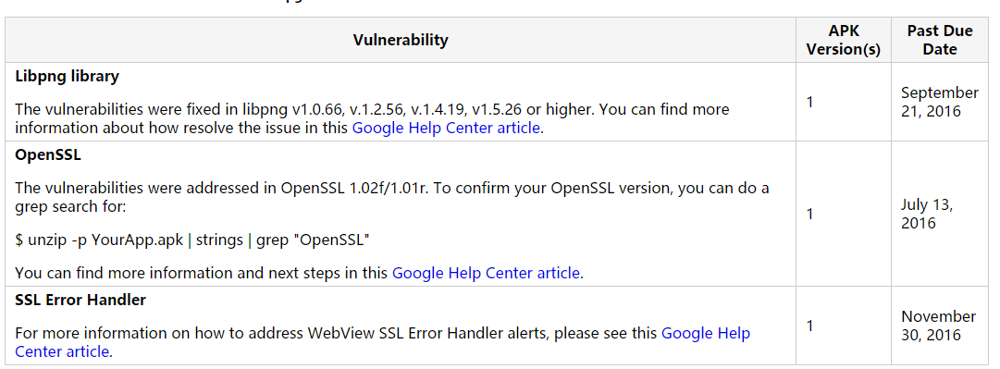

&#8194;&#8194;&#8194;&#8194;最近在搞Google Play相关的工作，中间遇到很多问题，也学习到了很多。总结下来，发布一个Google系列。首先先说一说首次提审的时候，遇到的三大问题吧。<br>
&#8194;&#8194;&#8194;&#8194;在后台提交之后，没多久我收到了一封来自Google团队的邮件。具体提出了三个问题。
- Libpng library
- OpenSSL
- SSL Error Handler



&#8194;&#8194;&#8194;&#8194;前两个问题都是因为我们游戏使用的引擎版本太旧导致的，毕竟是Cocos2d2.2.6的版本，所以在网上搜了很多的so，都是有问题的。这里贴一个地址，可以前往<a href="https://github.com/cocos2d/cocos2d-x-3rd-party-libs-bin/tree/v2">下载</a>。使用<b>cocos2d-x-3rd-party-libs-bin-2\cocos2dx\platform\third_party\android\prebuilt</b>下的libcurl、zlib和libpng替换引擎<b>cocos2dx\platform\third_party\android\prebuilt</b>下的文件夹，Android.mk文件自行检查修改。<br>
&#8194;&#8194;&#8194;&#8194;替换之后可以使用命令行查询OpenSSL，查看输出内容中的版本是否符合Google要求。（我这里是1.0.2g，所以符合要求）
```
$ unzip -p YourApp.apk | strings | grep "OpenSSL"
```

```
IDEA part of OpenSSL 1.0.2g  1 Mar 2016
CAMELLIA part of OpenSSL 1.0.2g  1 Mar 2016
EDSA part of OpenSSL 1.0.2g  1 Mar 2016
ECDSA part of OpenSSL 1.0.2g  1 Mar 2016
ECDH part of OpenSSL 1.0.2g  1 Mar 2016
RAND part of OpenSSL 1.0.2g  1 Mar 2016
CONF part of OpenSSL 1.0.2g  1 Mar 2016
CONF_def part of OpenSSL 1.0.2g  1 Mar 2016
TXT_DB part of OpenSSL 1.0.2g  1 Mar 2016
+SHA part of OpenSSL 1.0.2g  1 Mar 2016
RIPE-MD160 part of OpenSSL 1.0.2g  1 Mar 2016
3RC4 part of OpenSSL 1.0.2g  1 Mar 2016
:Blowfish part of OpenSSL 1.0.2g  1 Mar 2016
\CAST part of OpenSSL 1.0.2g  1 Mar 2016
```
&#8194;&#8194;&#8194;&#8194;浪费我时间最久的就是SSL Error Handler问题了。点开邮件中的连接，看到Google给出的解释是，我的app中使用的 WebViewClient.onReceivedSslError方法有安全隐患。在app中使用过该方法的小伙伴可以尝试这样修改一下。
```java
@Override
public void onReceivedSslError(WebView view, final SslErrorHandler handler, SslError error) {
    final AlertDialog.Builder builder = new AlertDialog.Builder(this);
    builder.setMessage(R.string.notification_error_ssl_cert_invalid);
    builder.setPositiveButton("continue", new DialogInterface.OnClickListener() {
        @Override
        public void onClick(DialogInterface dialog, int which) {
            handler.proceed();
        }
    });
    builder.setNegativeButton("cancel", new DialogInterface.OnClickListener() {
        @Override
        public void onClick(DialogInterface dialog, int which) {
            handler.cancel();
        }
    });
    final AlertDialog dialog = builder.create();
    dialog.show();
}
```
&#8194;&#8194;&#8194;&#8194;本以为找到改一下就可以结束了。但是...我查了一下代码，我并没有使用过这个方法！！！我询问了自家SDK的开发工程师，得知SDK中确实使用过此方法，改正之后又发给我了一个新的jar。替换之后，再次打包提审，再次被拒。<br>
&#8194;&#8194;&#8194;&#8194;懵了\~后来在网上看到有人说umeng分享SDK中的jar有问题，使用如下命令：
```
$ find . -name '*.jar' -exec zipgrep -i onreceivedsslerror {} \;
```
&#8194;&#8194;&#8194;&#8194;得出如下输出：
```
com/umeng/socialize/view/q.class:Binary file (standard input) matches
com/umeng/socialize/view/j.class:Binary file (standard input) matches
```
&#8194;&#8194;&#8194;&#8194;感人\~反正是上Google，也用不到umeng分享了。就直接把分享相关的模块干掉了。以防万一，我把所有用到的jar都查询了一遍，确认无误后。再次提审，通过。美滋滋\~


参考文献：<br>
https://blog.csdn.net/amazing_alex/article/details/71410670

https://blog.csdn.net/kingoneyun/article/details/54581764?locationNum=6&fps=1
