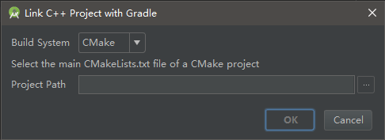
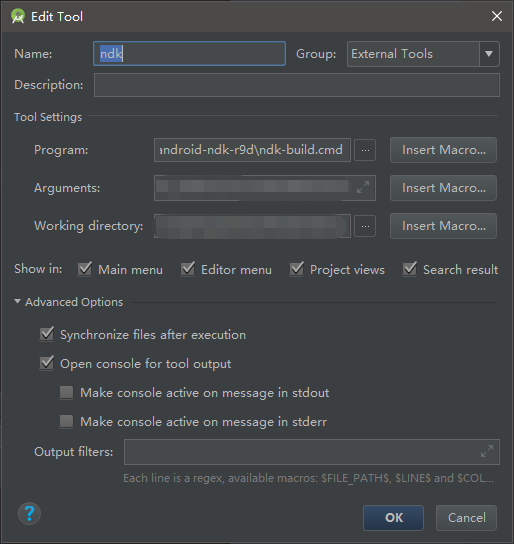

&#8194;&#8194;&#8194;&#8194;首先，引擎这么老的版本，为什么要搞Android Studio移植呢？呵~还不是因为要发Google Play惹的祸<br>
&#8194;&#8194;&#8194;&#8194;本来天真的以为还像往常一样，创建一个插件工程，抽离主工程，就可以完事大吉了。后来发现自家SDK的res文件夹下的xml文件无法解析，仔细问了一下SDK开发工程师，他居然告诉我，因为集成了Google服务相关内容，所以必须用Android Studio做开发。这是什么屁规定，不过仔细一想，毕竟都是人家Google自家的东西，就是喂给你个屁，你也要吃下去，并且大喊一声，真香。<br>


&#8194;&#8194;&#8194;&#8194;言归正传，先用eclipse导出gradle，这上网百度就能找得到。

1. 根目录下的<b>local.properties</b>文件中，修改好ndk.dir和sdk.dir
```
## This file must *NOT* be checked into Version Control Systems,
# as it contains information specific to your local configuration.
#
# Location of the SDK. This is only used by Gradle.
# For customization when using a Version Control System, please read the
# header note.
#Thu Aug 16 18:48:03 CST 2018
ndk.dir=H\:\\tools\\android-ndk-r9d
sdk.dir=C\:\\Users\\2069\\AppData\\Local\\Android\\Sdk

```
2. 根目录下的<b>gradle.properties</b>（没有的话自行创建）文件中添加如下代码
```properties
org.gradle.daemon=true
org.gradle.parallel=true
#org.gradle.jvmargs=-Xmx4096m -XX:MaxPermSize=4096m -XX:+HeapDumpOnOutOfMemoryError -Dfile.encoding=UTF-8
#这里设置java虚拟机内存
org.gradle.jvmargs=-Xms8192m -Xmx8192m
#这里打开NDK编译
android.useDeprecatedNDK = true
```
3. 根目录下的<b>build.gradle</b>文件中，做如下修改
```gradle
// Top-level build file where you can add configuration options common to all sub-projects/modules.
buildscript {
    repositories {
        //这里使用的是国内阿里云提供的库，不会使用科学上网的玩家可以选择使用这个地址来下载，不过可能更新比Google有些延迟，而且有些库可能会找不到。
        //maven{ url 'http://maven.aliyun.com/nexus/content/groups/public/' }
        //maven{ url 'http://maven.aliyun.com/nexus/content/repositories/jcenter'}

        //那么这里使用的就是Google提供的库，需要科学上网才可以访问下载得到。
        maven{ url 'https://dl.google.com/dl/android/maven2/'}
        jcenter()
        google()
    }
    dependencies {
        //这里我选用和SDK相同的gradle的Android插件版本，每个插件版本都对应着必需的Gradle版本。这里附上官网传送门：https://developer.android.google.cn/studio/releases/gradle-plugin#updating-plugin
        classpath 'com.android.tools.build:gradle:3.1.4'
        //这里可能是因为使用的Google的统计服务，所以应SDK文档的要求，添加了此配置。
        classpath 'com.google.gms:google-services:3.1.0'
    }
}

allprojects {
    repositories {
        //这里同上
        //maven { url 'http://maven.aliyun.com/nexus/content/groups/public/' }
        //maven{ url 'http://maven.aliyun.com/nexus/content/repositories/jcenter'}

        //这里同上
        maven{ url 'https://dl.google.com/dl/android/maven2/'}
        jcenter()
    }
}

//这里根据SDK Demo粘贴
task clean(type: Delete) {
    delete rootProject.buildDir
}
```
4. 根目录下的<b>gradle\wrapper\gradle-wrapper.properties</b>修改如下
```
#Tue Aug 14 21:16:23 CST 2018
distributionBase=GRADLE_USER_HOME
distributionPath=wrapper/dists
zipStoreBase=GRADLE_USER_HOME
zipStorePath=wrapper/dists
#这里同样是根据SDK的配置来修改的，具体使用哪个版本，需要根据前边提到的gradle的Android插件版本以及官网地址查询具体应使用的版本。
distributionUrl=https\://services.gradle.org/distributions/gradle-4.4-all.zip
```
Plugin version | Required Gradle version
---|---
1.0.0 - 1.1.3 | 2.2.1 - 2.3
1.2.0 - 1.3.1 | 2.2.1 - 2.9
1.5.0 | 2.2.1 - 2.13
2.0.0 - 2.1.2 | 2.10 - 2.13
2.1.3 - 2.2.3 | 2.14.1+
2.3.0+ | 3.3+
3.0.0+ | 4.1+
3.1.0+ | 4.4+
摘自官网（侵删）：https://developer.android.google.cn/studio/releases/gradle-plugin#updating-plugin

1. 主工程目录下的<b>local.properties</b>、<b>gradle.properties</b>（没有的话自行创建）文件我也做了相关配置，和根目录下相同。这里说一下什么是主工程目录，什么是跟目录，我的工程是这样的，再接入SDK之前，我会把SDK部分单独抽出来，作为一个插件工程，然后游戏部分的相关内容是一个主工程，在eclipse中主工程依赖这个插件工程就OK了。那跟目录顾名思义就是包含Cocos2d相关、SDK相关和游戏资源等的最外层目录，当你使用eclipse导出gradle的时候，你的根目录下会产生一个gradle文件夹。
2. 主工程目录下的<b>build.gradle</b>导入需要引用的相关jar，<b>compile</b>关键字好像过时了，所以换用了<b>implementation</b>。具体修改及注释如下
```gradle
apply plugin: 'android'
apply plugin: 'com.google.gms.google-services'

dependencies {
    compile fileTree(include: '*.jar', dir: 'libs')
    compile project(':plugin:protocols:proj.android')
    compile project(':plugin:plugins:umeng:proj.android')
    compile project(':plugin:plugins:ZQGameSEA:proj.android')
    //compile project(':plugin:plugins:umeng:proj.android')
    implementation files('../../../external/sdk/UMSocial/proj.android/sdk/umeng_social_sdk.jar')
    implementation files('../../../external/sdk/UMSocial/proj.android/sdk/httpmime-4.1.3.jar')
    implementation files('../../../external/sdk/UMSocial/proj.android/sdk/SocialSDK_QQZone_1.jar')
    implementation files('../../../external/sdk/UMSocial/proj.android/sdk/SocialSDK_QQZone_2.jar')
    implementation files('../../../external/sdk/UMSocial/proj.android/sdk/SocialSDK_QQZone_3.jar')
    implementation files('../../../external/sdk/UMSocial/proj.android/sdk/SocialSDK_Sina.jar')
    implementation files('../../../plugin/plugins/umeng/proj.android/libs/umeng_sdk.jar')
    implementation files('../../../external/sdk/xg/proj.android/jg_filter_sdk_1.1.jar')
    implementation files('../../../external/sdk/xg/proj.android/wup-1.0.0.E-SNAPSHOT.jar')
    implementation files('../../../external/sdk/xg/proj.android/Xg_sdk_v2.41_20150915_1121.jar')
    implementation files('../../../external/sdk/bugly/proj.android/bugly_1.2.9_release.jar')
    implementation files('../../../external/sdk/bugly/proj.android/bugly_cocos2dx_1.2.9_release.jar')
    //    implementation files('../../../external/sdk/baiduLocation/proj.android/BaiduLBS_Android.jar')
    //    implementation files('libs/android-support-v4.jar')
}

android {
    //编译工具版本号不能大于下边的构建版本号
    compileSdkVersion 21
    buildToolsVersion '28.0.2'

    //这里给Java堆分配最大内存8g
    dexOptions {
        incremental true
        javaMaxHeapSize "8g"
    }

    defaultConfig {
        //包名
        applicationId "com.game.ultramansol_sea"
        //支持最小的Android SDK API版本
        minSdkVersion 17
        //目标版本
        targetSdkVersion 21
        //这里和版本号相关的内容同以前在eclipse中的清单文件相同
        versionCode 1
        versionName "1.2.22"
        //添加NDK相关配置，moduleName为jni文件夹下的Android.mk的LOCAL_MODULE_FILENAME参数，abiFilters支持的架构。
        ndk {
            moduleName "libultraman"
            ldLibs "log", "z", "m"
            abiFilters "armeabi-v7a", "armeabi"
        }
        multiDexEnabled true
    }

//    externalNativeBuild {
//        ndkBuild {
//            path file("jni/Android.mk")
//        }
//    }

    sourceSets {
        main {
            manifest.srcFile 'AndroidManifest.xml'
            java.srcDirs = ['src']
            resources.srcDirs = ['src']
            aidl.srcDirs = ['src']
            renderscript.srcDirs = ['src']
            res.srcDirs = ['res']
            assets.srcDirs = ['assets']
            jni.srcDirs = []//设置禁止gradle生成Android.mk
            jniLibs.srcDirs = ['libs']//设置目标的so存放,也就是组装到apk中的so路径
            jniLibs.srcDir '../../../;../../../cocos2dx/platform/third_party/android/prebuilt;../../../projects/ultraman/Classes'
//            jni.srcDirs 'jni/hellolua'
        //NDK_PROJECT_PATH =
        }

        // Move the tests to tests/java, tests/res, etc...
        androidTest.setRoot('tests')

        // Move the build types to build-types/<type>
        // For instance, build-types/debug/java, build-types/debug/AndroidManifest.xml, ...
        // This moves them out of them default location under src/<type>/... which would
        // conflict with src/ being used by the main source set.
        // Adding new build types or product flavors should be accompanied
        // by a similar customization.
        debug.setRoot('build-types/debug')
        release.setRoot('build-types/release')
    }

//    tasks.withType(JavaCompile) {
//        compileTask -> compileTask.dependsOn 'ndkBuild','copyThirdso', 'copyJniLibs'
//    }
//    task ndkBuild(type: Exec) {
//        def ndkBuildingDir = project.android.ndkDirectory//project.plugins.findPlugin('com.android.application').sdkHandler.getNdkFolder().absolutePath
//        println ndkBuildingDir
//        println 111
//        commandLine "$ndkBuildingDir/ndk-build.cmd", '-C', file('jni').absolutePath,
//                '-j', Runtime.runtime.availableProcessors(),
//                "NDK_OUT=$buildDir/intermediates/ndk/obj",
//                "NDK_APP_DST_DIR=$buildDir/intermediates/ndk/libs/\$(TARGET_ARCH_ABI)"
//    } //设置新的so的生成目录
//
//    task copyJniLibs(type: Copy) {
//
//        from fileTree(dir: file(buildDir.absolutePath + '/intermediates/ndk/libs'), include: '**/*.so')
//        into file('libs')
//    }       //将新生成的so拷贝到jniLibs目录
//
//    task copyThirdso(type: Copy) {
//        from file('jni/prebuilt')
//        into file('libs')
//    }               //将第三方的so拷贝到jniLibs目录

    buildTypes {
        release {
            minifyEnabled false
            proguardFiles getDefaultProguardFile('proguard-android.txt'), 'proguard-rules.txt'
        }

    }
}

```
7. 设置AS的内存大小，点击<b>Help -> Edit Custom VM Options</b>，弹出studio64.exe.vmoptions文件，在其中插入如下代码，AS右下角的allocated heap size会变成8G。如果没有请尝试重启AS。
```
# custom Android Studio VM options, see https://developer.android.com/studio/intro/studio-config.html
-Xms8192m
-Xmx8192m
-XX:MaxPermSize=8192m
-XX:ReservedCodeCacheSize=200m
-XX:+UseCompressedOops
-XX:ReservedCodeCacheSize=240m
-XX:+UseConcMarkSweepGC
-XX:SoftRefLRUPolicyMSPerMB=50
-Dsun.io.useCanonCaches=false
-Djava.net.preferIPv4Stack=true
-Djna.nosys=true
-Djna.boot.library.path=

-da

```
8. 在目录列表选择<b>Project</b>视图，找到主工程，右键jni文件夹（可能别的文件夹也行），选择<b>Link C++ Project With Gradle</b>，<b>Build System</b>选择<b>ndk-build</b>选项，在<b>Project Path</b>中设置“主工程/jni/Android.mk”路径，选择<b>OK</b>。<br>

9. 设置NDK编译工具，<b>File -> Settings -> Tools -> External Tools</b>，点击“+”。<b>Name</b>自己取名，<b>Program</b>为ndk-build.cmd的路径，<b>Arguments</b>为编译时需要的参数“NDK_MODULE_PATH=（自己的NDK_MODULE_PATH）”，<b>Working directory</b>为主工程路径，点击<b>OK</b>。<br>

10. <b>Run/Debug Configurations</b>，在下边点击“<b>+</b>”，添加<b>Run External tool</b>，选择刚刚添加的“ndk”工具。如果不打算烧在真机上，想直接打包的话。在打包之前，请记得<b>右键->External Tools->ndk</b>，进行NDK编译。

&#8194;&#8194;&#8194;&#8194;到此为止，基本结束了配置，可能还会有些小问题，自行百度或者Google应该就可以解决了。还有就是插件工程中以前有引用jar的，别忘记在对应工程下的<b>build.gradle</b>文件中引用。还有就是清单文件的坑，AS中检查可能比较严格，所有插件工程的<b>minSdkVersion</b>和<b>targetSdkVersion</b>必须一致，不然会报错。还有，如果出现多个分包APK并且找不到编译生成的so错误时，可以尝试把<b>Instant Run</b>关掉。

NDK编译相关的官网地址：https://developer.android.google.cn/studio/projects/add-native-code#ndkCompile