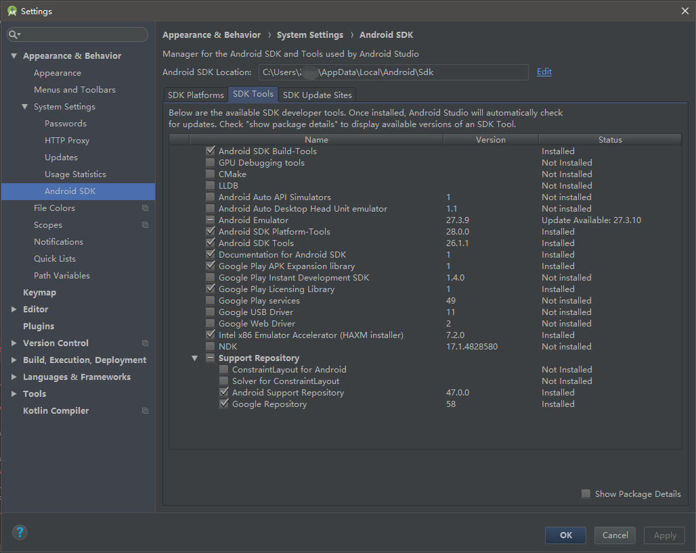

&#8194;&#8194;&#8194;&#8194;最近搞Google Play的这件事情，真的是焦头烂额。项目太老了。。。根本不支持AS工程，也就别想支持obb文件解析了。<br>
&#8194;&#8194;&#8194;&#8194;实质上obb文件就是一个ZIP文件。有两种方式可以生成：<br>
&#8194;&#8194;&#8194;&#8194;一种是Google官方提供的Jobb工具来生成obb文件。工具可以在 Android\sdk\tools\bin文件夹下找到。命令行用法和参数如下：
```
jobb -d [所有资源的路径] -o [生成的obb名称（请遵循上述命名规则）] -k [打包密码] -pn [包名] -pv [versionCode(跟obb名称的versionCode一致)]
```
&#8194;&#8194;&#8194;&#8194;也可以使用该工具对obb文件进行解压：
```
jobb -d [输出路径] -o [obb文件名] -k [打包所用的密码]
```
&#8194;&#8194;&#8194;&#8194;另一种是使用压缩工具，将资源从assets路径下开始压缩，命名方式为
```
main.[versionCode].[packageName].obb
```
&#8194;&#8194;&#8194;&#8194;还有一种是使用build.gradle中添加脚本，有兴趣使用此方法的可以自行<a href="www.baidu.com">百度</a>或<a href="www.google.com">Google</a>。因为我使用的是第二种方法。<br>
&#8194;&#8194;&#8194;&#8194;在使用之前，需要下载一个Google官方提供的库，可以打开Android Studio（<b>File</b> -> <b>Settings</b> -> <b>Appearance & Behavior</b> -> <b>System Settings</b> -> <b>Android SDK</b> -> <b>SDK Tools</b>)，选择<b>Google Play APK Expansion library</b>和<b>Google Play Licensing Library</b>，<b>Apply</b>下载。但这里不建议勾选<b>Google Play APK Expansion library</b>，原因后边详述。（可以在这里<a href="https://github.com/google/play-apk-expansion">下载</a>）<br>
<br>
&#8194;&#8194;&#8194;&#8194;下载完成之后，在<b>C:\Users\xxx\AppData\Local\Android\Sdk\extras\google\market_apk_expansion</b>或者apkx_library中找到zip_file，作为module引用到工程。（apkx_library在使用上面连接下载的目录中）<br>
&#8194;&#8194;&#8194;&#8194;我们先修改obb文件读取的逻辑。首先修改主activity类，也就是Cocos2dxActivity.java的派生类。
<!--因为Google官方似乎并没有做维护更新，已经年久失修了-->
____________________________
#### MainActivity.java
____________________________
```java
public static String FATE_OBB_PATH = "";

public String getObbFileName() {
	PackageInfo info = null;
	try {
		info = super.getPackageManager().getPackageInfo(super.getPackageName(), 0);
		String fileName = "main." + info.versionCode + "." + getPackageName() + ".obb";

		return fileName;
	} catch (PackageManager.NameNotFoundException e) {
		e.printStackTrace();
	}
	return "";
}
public String getVirtualObbFileFullpath(){
	File sdcardDir = Environment.getExternalStorageDirectory();
	String _path = getObbDir().getPath() + "/" + getObbFileName();
	Log.e("===_path===", _path);
	return _path;
}

protected void onCreate(Bundle savedInstanceState){
	Log.w("uuuuuuuuuu","onCreate");

	FATE_OBB_PATH = getVirtualObbFileFullpath();//这句需要放在super.onCreate上面

	super.onCreate(savedInstanceState);
}

```
______________________________
#### Cocos2dxHelper.java
______________________________
```java
public static ZipResourceFile obbzip = null;

public static void init(final Context pContext, final Cocos2dxHelperListener pCocos2dxHelperListener) {

	// begin--------------------添加代码----------------------------
	//检查obb文件是否存在
	if(fileIsExists(ultraman.FATE_OBB_PATH)){
		//存在添加obb路径到cocos中 注意 nativeSetObbPath 方法是需要新添加的 下方会介绍
		Cocos2dxHelper.nativeSetObbPath(ultraman.FATE_OBB_PATH);
	}
	// end--------------------添加代码----------------------------
	
	final ApplicationInfo applicationInfo = pContext.getApplicationInfo();
		
	Cocos2dxHelper.sContext = pContext;
	Cocos2dxHelper.sCocos2dxHelperListener = pCocos2dxHelperListener;

	Cocos2dxHelper.sPackageName = applicationInfo.packageName;
	Cocos2dxHelper.sFileDirectory = pContext.getFilesDir().getAbsolutePath();
	Cocos2dxHelper.nativeSetApkPath(applicationInfo.sourceDir);

	Cocos2dxHelper.sCocos2dxAccelerometer = new Cocos2dxAccelerometer(pContext);
	Cocos2dxHelper.sCocos2dMusic = new Cocos2dxMusic(pContext);
	int simultaneousStreams = Cocos2dxSound.MAX_SIMULTANEOUS_STREAMS_DEFAULT;
    if (Cocos2dxHelper.getDeviceModel().indexOf("GT-I9100") != -1) {
        simultaneousStreams = Cocos2dxSound.MAX_SIMULTANEOUS_STREAMS_I9100;
    }
    Cocos2dxHelper.sCocos2dSound = new Cocos2dxSound(pContext, simultaneousStreams);
	Cocos2dxHelper.sAssetManager = pContext.getAssets();

	//设置压缩包
	PackageInfo info = null;
	try {
		info = pContext.getPackageManager().getPackageInfo(pContext.getPackageName(), 0);
		Cocos2dxHelper.obbzip = APKExpansionSupport.getAPKExpansionZipFile(pContext,info.versionCode,0);
	} catch (PackageManager.NameNotFoundException e1) {
		e1.printStackTrace();
	} catch (IOException e1) {
		e1.printStackTrace();
	}
	// end--------------------添加代码----------------------------

	Cocos2dxBitmap.setContext(pContext);
	Cocos2dxETCLoader.setContext(pContext);
	
}

//检查obb文件是否存在
public static boolean fileIsExists(String strFile)
{
	try
	{
		File f=new File(strFile);
		if(!f.exists())
		{
			return false;
		}

	}
	catch (Exception e)
	{
		return false;
	}

	return true;
}

//nativeSetObbPath 设置obb路径方法
private static native void nativeSetObbPath(final String pObbPath);

```
____________________________________
 #### Cocos2dxMusic.java 和 Cocos2dxSound.java 
____________________________________
```java
//Cocos2dxMusic.java
private MediaPlayer createMediaplayer(final String pPath) {
	MediaPlayer mediaPlayer = new MediaPlayer();

	try {
		if (pPath.startsWith("/")) {
			final FileInputStream fis = new FileInputStream(pPath);
			mediaPlayer.setDataSource(fis.getFD());
			fis.close();
		} else {
		    //-------------------modify begin-----------------
			final AssetFileDescriptor assetFileDescritor =  Cocos2dxHelper.obbzip.getAssetFileDescriptor("assets/"+pPath);
			if(assetFileDescritor == null) {
				final AssetFileDescriptor assetFileDescritor1 = this.mContext.getAssets().openFd(pPath);
				mediaPlayer.setDataSource(assetFileDescritor1.getFileDescriptor(), assetFileDescritor1.getStartOffset(), assetFileDescritor1.getLength());
			}else{
				mediaPlayer.setDataSource(assetFileDescritor.getFileDescriptor(), assetFileDescritor.getStartOffset(), assetFileDescritor.getLength());
			}
			//-------------------modify end-----------------
		}

		mediaPlayer.prepare();

		mediaPlayer.setVolume(this.mLeftVolume, this.mRightVolume);
	} catch (final Exception e) {
		mediaPlayer = null;
		Log.e(Cocos2dxMusic.TAG, "error: " + e.getMessage(), e);
	}

	return mediaPlayer;
}
//Cocos2dxSound.java
public int createSoundIDFromAsset(final String pPath) {
	int soundID = Cocos2dxSound.INVALID_SOUND_ID;

	try {
		if (pPath.startsWith("/")) {
			soundID = this.mSoundPool.load(pPath, 0);
		} else {
    		//-------------------modify begin-----------------
			final AssetFileDescriptor assetFileDescritor =  Cocos2dxHelper.obbzip.getAssetFileDescriptor("assets/"+pPath);
			if(assetFileDescritor == null) {
				soundID = this.mSoundPool.load(this.mContext.getAssets().openFd(pPath), 0);
			}else{
				soundID = this.mSoundPool.load(assetFileDescritor, 0);
			}
			//-------------------modify end-----------------
		}
	} catch (final Exception e) {
		soundID = Cocos2dxSound.INVALID_SOUND_ID;
		Log.e(Cocos2dxSound.TAG, "error: " + e.getMessage(), e);
	}

	// mSoundPool.load returns 0 if something goes wrong, for example a file does not exist
	if (soundID == 0) {
		soundID = Cocos2dxSound.INVALID_SOUND_ID;
	}

	return soundID;
}
```
__________________________
#### Java_org_cocos2dx_lib_Cocos2dxHelper.cpp
__________________________
```cpp
string g_apkPath;
//添加obb path
string g_obbPath;
//添加设置obbpath 方法
 JNIEXPORT void JNICALL Java_org_cocos2dx_lib_Cocos2dxHelper_nativeSetObbPath(JNIEnv*  env, jobject thiz, jstring obbPath) {
    g_obbPath = JniHelper::jstring2string(obbPath);
}
//添加获取obbpath 方法
const char * getObbPath() {
    return g_obbPath.c_str();
}
```
________________________
#### CCFileUtilsAndroid.cpp
________________________
```cpp
//CCFileUtilsAndroid.h头文件中需要加入 extern const char * getObbPath();方法

//在 s_pZipFile 下添加一个 obb zip包解析
static ZipFile *s_pZipFileobb = NULL;

CCFileUtils* CCFileUtils::sharedFileUtils()
{
    if (s_sharedFileUtils == NULL)
    {
        s_sharedFileUtils = new CCFileUtilsAndroid();
        s_sharedFileUtils->init();
        std::string resourcePath = getApkPath();
        s_pZipFile = new ZipFile(resourcePath, "assets/");
        // ---------- modify begin -----------
        //获取obb路径
        std::string resourcePath_Obb = getObbPath();
        CCLOG("LJM test CCFileUtilsAndroid::sharedFileUtils resourcePath_Obb: %s", resourcePath_Obb.c_str());
        //  创建obbzip
        s_pZipFileobb = new ZipFile(resourcePath_Obb,"assets/");
        CCLOG("LJM test CCFileUtilsAndroid::sharedFileUtils s_pZipFileobb: %p", s_pZipFileobb);
        // ---------- modify end -----------
    }
    return s_sharedFileUtils;
}

CCFileUtilsAndroid::~CCFileUtilsAndroid()
{
    CC_SAFE_DELETE(s_pZipFile);
    //销毁
    CC_SAFE_DELETE(s_pZipFileobb);
}

bool CCFileUtilsAndroid::isFileExist(const std::string& strFilePath)
{
    if (0 == strFilePath.length())
    {
        return false;
    }

    bool bFound = false;
    
    // Check whether file exists in apk.
    CCLOG("LJM test CCFileUtilsAndroid::isFileExist strFilePath: %s", strFilePath.c_str());
    if (strFilePath[0] != '/')
    {
        std::string strPath = strFilePath;
        if (strPath.find(m_strDefaultResRootPath) != 0)
        {// Didn't find "assets/" at the beginning of the path, adding it.
            strPath.insert(0, m_strDefaultResRootPath);
        }

        if (s_pZipFile->fileExists(strPath))
        {
            bFound = true;
        } 
        // ---------- modify begin -----------
        CCLOG("LJM test CCFileUtilsAndroid::isFileExist bFound: %d", bFound);
        if(!bFound){
           
            if (s_pZipFileobb->fileExists(strPath))
            {
                
                bFound = true;
            } 
        }
        CCLOG("LJM test CCFileUtilsAndroid::isFileExist bFound1: %d", bFound);
        // ---------- modify end -----------
    }
    else
    {
        FILE *fp = fopen(strFilePath.c_str(), "r");
        if(fp)
        {
            bFound = true;
            fclose(fp);
        }
    }
    return bFound;
}

unsigned char* CCFileUtilsAndroid::doGetFileData(const char* pszFileName, const char* pszMode, unsigned long * pSize, bool forAsync)
{
    unsigned char * pData = 0;
    
    if ((! pszFileName) || (! pszMode) || 0 == strlen(pszFileName))
    {
        return 0;
    }
    
    string fullPath = fullPathForFilename(pszFileName);
    CCLOG("liuwen test CCFileUtilsAndroid::doGetFileData fullPath: %s", fullPath.c_str());

    if (fullPath[0] != '/')
    {
        CCLOG("LJM test CCFileUtilsAndroid::doGetFileData forAsync: %d", forAsync);
        if (forAsync)
        {
            pData = s_pZipFile->getFileData(fullPath.c_str(), pSize, s_pZipFile->_dataThread);
            CCLOG("LJM test CCFileUtilsAndroid::doGetFileData pData: %p", pData);
            // ---------- modify begin -----------
            if (! pData)
            {
                pData = s_pZipFileobb->getFileData(fullPath.c_str(), pSize, s_pZipFile->_dataThread);
            }
            //---------- modify end -----------
        }
        else
        {
            pData = s_pZipFile->getFileData(fullPath.c_str(), pSize);
            CCLOG("LJM test CCFileUtilsAndroid::doGetFileData else pData: %p", pData);
            // ---------- modify begin -----------
            if (! pData)
            {
                pData = s_pZipFileobb->getFileData(fullPath.c_str(), pSize);
            }
            //---------- modify end -----------
        }
    }
    else
    {
        do
        {
            // read rrom other path than user set it
            //CCLOG("liuwen test fopen  pszMode: %s", pszMode);
            FILE *fp = fopen(fullPath.c_str(), pszMode);
            CC_BREAK_IF(!fp);
            
            unsigned long size;
            fseek(fp,0,SEEK_END);
            size = ftell(fp);
            fseek(fp,0,SEEK_SET);
            pData = new unsigned char[size];
            size = fread(pData,sizeof(unsigned char), size,fp);
            fclose(fp);
            
            //CCLOG("liuwen test fopen  size: %d", size);

            if (pSize)
            {
                *pSize = size;
            }
        } while (0);
    }

    if (! pData)
    {
        std::string msg = "Get data from file(";
        msg.append(pszFileName).append(") failed!");
        CCLOG("%s", msg.c_str());
    }
    
    //CCLOG("liuwen test fopen  pData not null ");
    return pData;
}
```
&#8194;&#8194;&#8194;&#8194;至此，读取相关的内容已经修改完毕。下面进行自测：
1. 如果手机已经获取root权限，可以下载一个RE文件管理器，把打包好的obb文件放在，<b>/storage/sdcard0/Android/obb/[包名]</b>路径下。
2. 手机没有获取root权限的情况下，可以使用adb命令。adb命令具体怎么配置怎么使用，请<a href="www.baidu.com">这里</a>。<br>

&#8194;&#8194;&#8194;&#8194;具体命令行：
```
$ adb push [obb文件路径] /storage/emulated/0/Android/obb/[包名]
```


参考文献：<br>
https://blog.csdn.net/androidworkor/article/details/70226726

https://www.jianshu.com/p/de3c53f69925