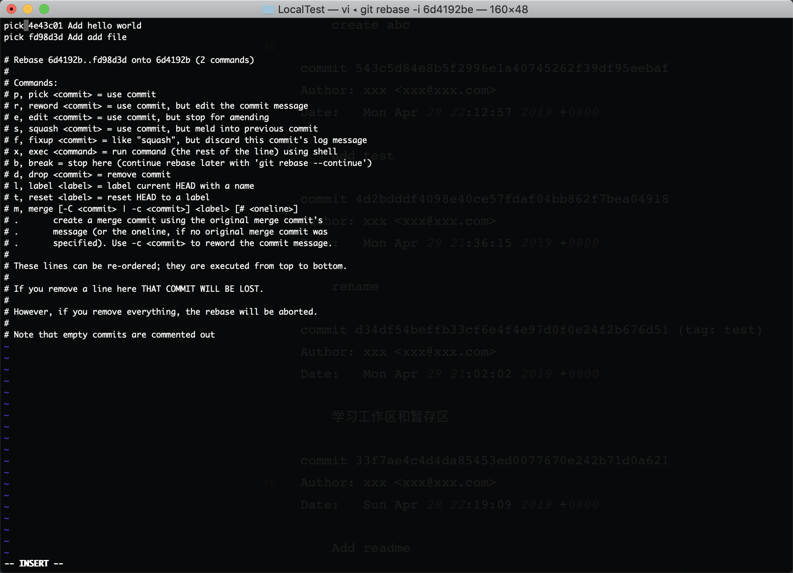
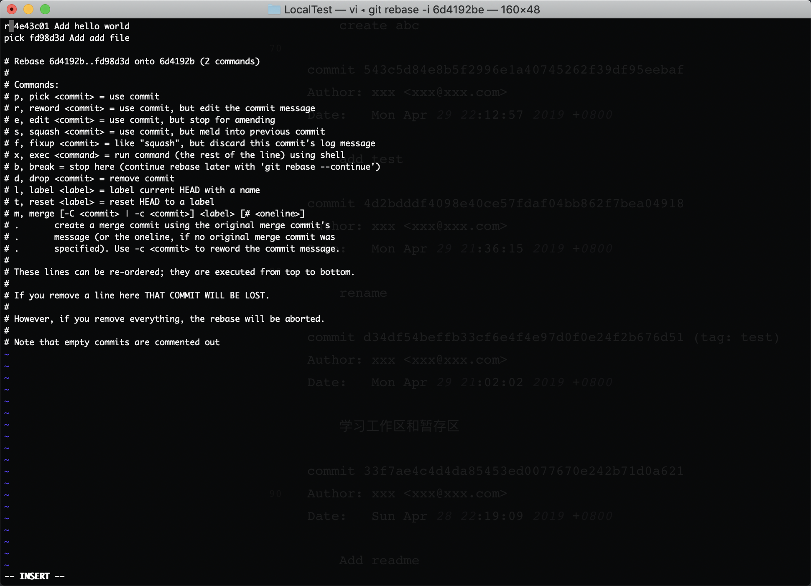

###修改commit的message
####修改最新commit的message
- $ git commit --amend
```bash
$ git log #先查看log 第一条信息为merge branch temp
commit 5524853e5b062ee5536925dc1e6a8b70db415253 (HEAD -> master)
Merge: 4b6999e 543c5d8
Author: xxx <xxx@xxx.com>
Date:   Sat May 25 18:27:23 2019 +0800

    merge branch temp

commit 4b6999eecb60df46af36c5409e3737e44b877dd7
Author: xxx <xxx@xxx.com>
Date:   Sun May 19 13:50:07 2019 +0800

    create folder and file

commit 6d4192be4c570363865468870d14f59efaa5521e
Author: xxx <xxx@xxx.com>
Date:   Sun May 19 13:46:22 2019 +0800

    create abc

commit 543c5d84e8b5f2996e1a40745262f39df95eebaf
Author: xxx <xxx@xxx.com>
Date:   Mon Apr 29 22:12:57 2019 +0800

    add test

commit 4d2bdddf4098e40ce57fdaf04bb862f7bea04918
Author: xxx <xxx@xxx.com>
Date:   Mon Apr 29 21:36:15 2019 +0800

    rename

commit d34df54beffb33cf6e4f4e97d0f0e24f2b676d51 (tag: test)
Author: xxx <xxx@xxx.com>
Date:   Mon Apr 29 21:02:02 2019 +0800

    学习工作区和暂存区

commit 33f7ae4c4d4da85453ed0077670e242b71d0a621
Author: xxx <xxx@xxx.com>
Date:   Sun Apr 28 22:19:09 2019 +0800

    Add readme
$ git commit --amend #将merge改成Merge
[master 1da4f5a] Merge branch temp
 Date: Sat May 25 18:27:23 2019 +0800
$ git log #再次查看 message已经被修改
commit 1da4f5a22942c99a466508cdea306619dd5c48b0 (HEAD -> master)
Merge: 4b6999e 543c5d8
Author: xxx <xxx@xxx.com>
Date:   Sat May 25 18:27:23 2019 +0800

    Merge branch temp

commit 4b6999eecb60df46af36c5409e3737e44b877dd7
Author: xxx <xxx@xxx.com>
Date:   Sun May 19 13:50:07 2019 +0800

    create folder and file

commit 6d4192be4c570363865468870d14f59efaa5521e
Author: xxx <xxx@xxx.com>
Date:   Sun May 19 13:46:22 2019 +0800

    create abc

commit 543c5d84e8b5f2996e1a40745262f39df95eebaf
Author: xxx <xxx@xxx.com>
Date:   Mon Apr 29 22:12:57 2019 +0800

    add test

commit 4d2bdddf4098e40ce57fdaf04bb862f7bea04918
Author: xxx <xxx@xxx.com>
Date:   Mon Apr 29 21:36:15 2019 +0800

    rename

commit d34df54beffb33cf6e4f4e97d0f0e24f2b676d51 (tag: test)
Author: xxx <xxx@xxx.com>
Date:   Mon Apr 29 21:02:02 2019 +0800

    学习工作区和暂存区

commit 33f7ae4c4d4da85453ed0077670e242b71d0a621
Author: xxx <xxx@xxx.com>
Date:   Sun Apr 28 22:19:09 2019 +0800

    Add readme

```
####修改老旧commit的message
- $ git rebase -i 6d4192be
```bash
$ git log -3 #查看近三次的log
commit d2c1d2b68622e6ee11c2070eb36406ccb0e63655 (HEAD -> fix_add)
Author: xxx <xxx@xxx.com>
Date:   Sun May 19 17:03:02 2019 +0800

    Add add file

commit ea0c4843f5ee874f4d96646d7f3a8a3adb1432f0
Author: xxx <xxx@xxx.com>
Date:   Sun May 19 16:33:15 2019 +0800

    Add hello world

commit 6d4192be4c570363865468870d14f59efaa5521e
Author: xxx <xxx@xxx.com>
Date:   Sun May 19 13:46:22 2019 +0800

    create abc
$ git rebase -i 6d4192be #使用rebase命令 选择需要修改message的父亲commit地址 会弹出交互界面 如下图
[detached HEAD ea0c484] Add hello world in file
 Date: Sun May 19 16:33:15 2019 +0800
 1 file changed, 1 insertion(+)
Successfully rebased and updated refs/heads/fix_add. #这里表示修改成功
$ git branch -av
* fix_add  d2c1d2b Add add file
  fix_add1 2241da2 Add "!"
  master   1da4f5a Merge branch temp
$ git log -n3 --graph #查看log 已经将Add hello world成功修改为Add hello world in file
* commit d2c1d2b68622e6ee11c2070eb36406ccb0e63655 (HEAD -> fix_add)
| Author: xxx <xxx@xxx.com>
| Date:   Sun May 19 17:03:02 2019 +0800
| 
|     Add add file
| 
* commit ea0c4843f5ee874f4d96646d7f3a8a3adb1432f0
| Author: xxx <xxx@xxx.com>
| Date:   Sun May 19 16:33:15 2019 +0800
| 
|     Add hello world in file
| 
* commit 6d4192be4c570363865468870d14f59efaa5521e
| Author: xxx <xxx@xxx.com>
| Date:   Sun May 19 13:46:22 2019 +0800
| 
|     create abc
```
#####图示

- 将pick改为reword简称r，然后退出保存



- 退出保存后，会弹出一个新的交互界面，将message修改为新的message，保存退出即可。