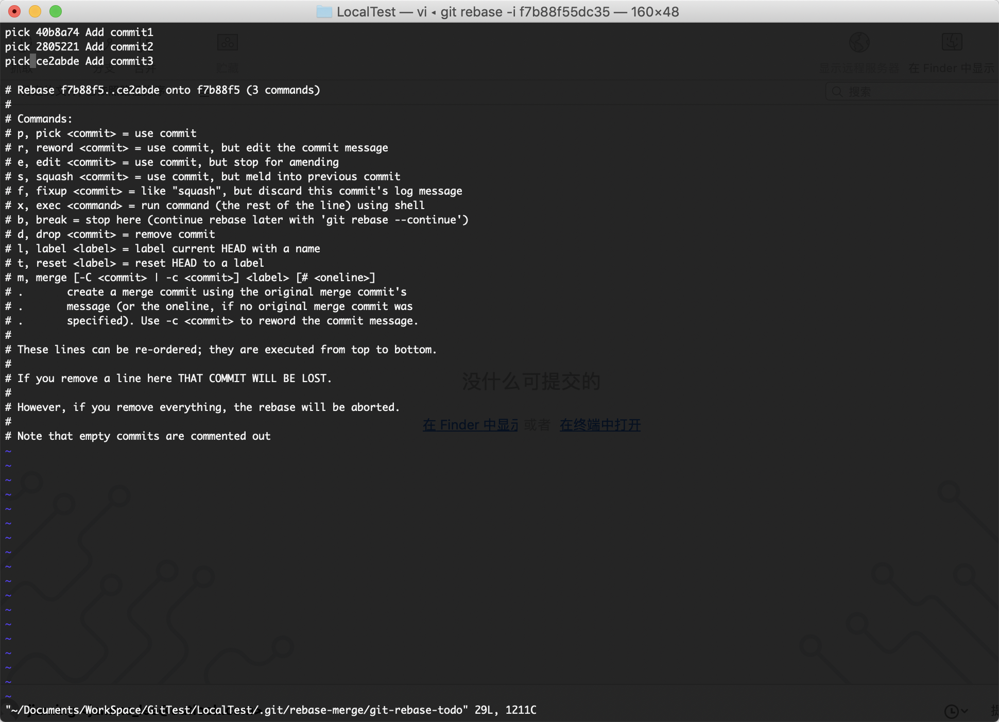
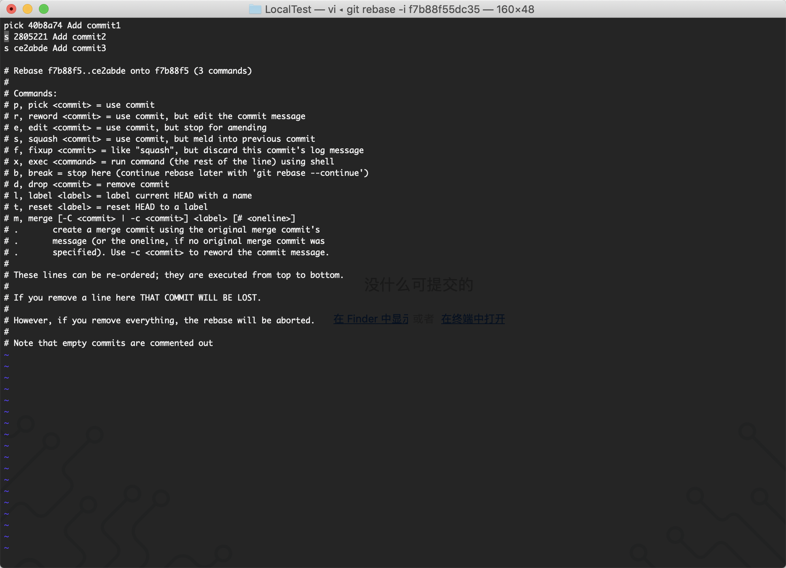
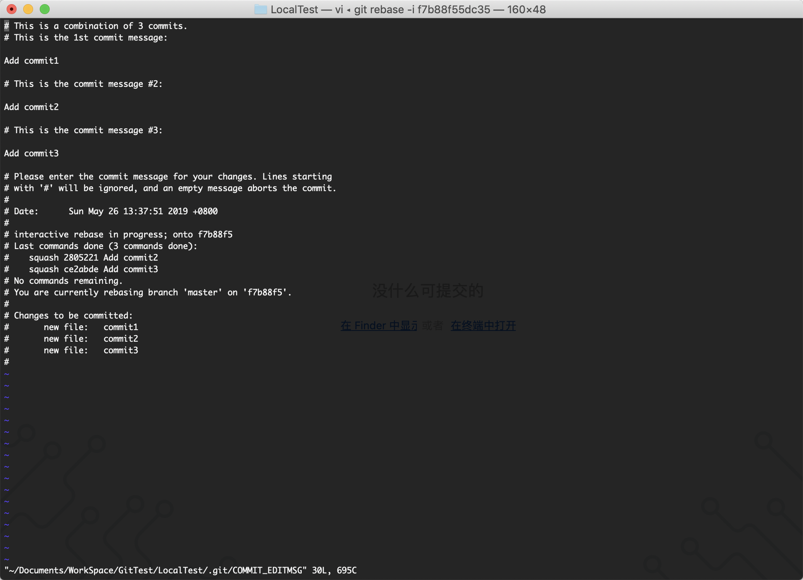
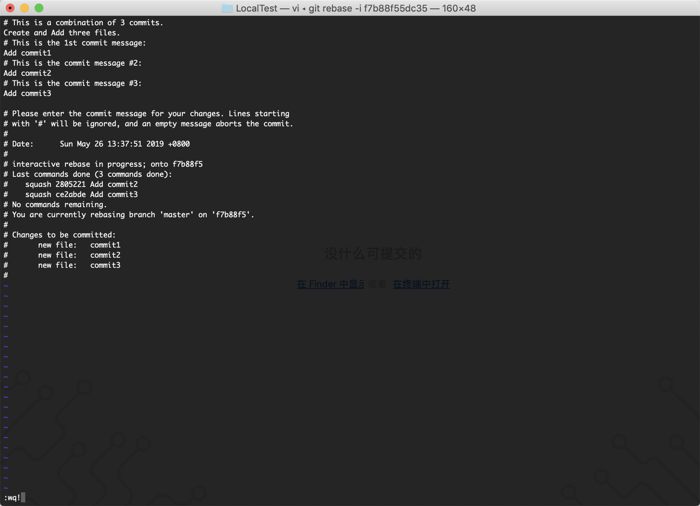

### 把连续的多个commit整理成1个

####git rebase -i [address]

```bash
$ git log -6 #查看log 合并最近三条commit
commit ce2abde0bf171ac220701f921fb7c80d59d1cabb (HEAD -> master)
Author: xxx <xxx@xxx.com>
Date:   Sun May 26 13:38:08 2019 +0800

    Add commit3

commit 2805221941eea19d8fea0acf26674af8315e5a3b
Author: xxx <xxx@xxx.com>
Date:   Sun May 26 13:37:59 2019 +0800

    Add commit2

commit 40b8a74be089723d8609f8561972069d045e33a2
Author: xxx <xxx@xxx.com>
Date:   Sun May 26 13:37:51 2019 +0800

    Add commit1

commit f7b88f55dc358c375cbbc26db54e7e87b551c518
Merge: 9e63410 d2c1d2b
Author: xxx <xxx@xxx.com>
Date:   Sun May 26 13:34:46 2019 +0800

    Merge all branch

commit 9e63410fee4af12a8e9855d2cb6ac81a977b821e
Merge: 1da4f5a 2241da2
Author: xxx <xxx@xxx.com>
Date:   Sun May 26 13:33:20 2019 +0800

    Merge branch 'fix_add1'

commit d2c1d2b68622e6ee11c2070eb36406ccb0e63655
Author: xxx <xxx@xxx.com>
Date:   Sun May 19 17:03:02 2019 +0800

    Add add file
$ git rebase -i f7b88f55dc35 #取父亲节点地址 弹出两次交互界面 如下图
[detached HEAD 9f2603b] Create and Add three files. Add commit1 Add commit2 Add commit3
 Date: Sun May 26 13:37:51 2019 +0800
 3 files changed, 0 insertions(+), 0 deletions(-)
 create mode 100644 commit1
 create mode 100644 commit2
 create mode 100644 commit3
Successfully rebased and updated refs/heads/master.
$ git log -6 --graph #再次查看log 已经合并成功 并生成了新的commit对象
* commit 9f2603b5aac31b0607312a51224a9691ed0670b4 (HEAD -> master)
| Author: xxx <xxx@xxx.com>
| Date:   Sun May 26 13:37:51 2019 +0800
| 
|     Create and Add three files.
|     Add commit1
|     Add commit2
|     Add commit3
|   
*   commit f7b88f55dc358c375cbbc26db54e7e87b551c518
|\  Merge: 9e63410 d2c1d2b
| | Author: xxx <xxx@xxx.com>
| | Date:   Sun May 26 13:34:46 2019 +0800
| | 
| |     Merge all branch
| | 
| * commit d2c1d2b68622e6ee11c2070eb36406ccb0e63655
| | Author: xxx <xxx@xxx.com>
| | Date:   Sun May 19 17:03:02 2019 +0800
| | 
| |     Add add file
| | 
| * commit ea0c4843f5ee874f4d96646d7f3a8a3adb1432f0
| | Author: xxx <xxx@xxx.com>
| | Date:   Sun May 19 16:33:15 2019 +0800
| | 
| |     Add hello world in file
| |   
* |   commit 9e63410fee4af12a8e9855d2cb6ac81a977b821e
|\ \  Merge: 1da4f5a 2241da2
| | | Author: xxx <xxx@xxx.com>
| | | Date:   Sun May 26 13:33:20 2019 +0800
| | | 
| | |     Merge branch 'fix_add1'
| | | 
| * | commit 2241da25049ad63dea9f20b094b858f0b533ed61
| | | Author: xxx <xxx@xxx.com>
| | | Date:   Sun May 19 17:01:01 2019 +0800
| | | 
| | |     Add "!"

```
####图示
- 执行“git rebase -i f7b88f55dc35”命令后，弹出第一个交互


- 选择squash命令，修改pick为s，保存退出


- 第二个交互界面


- 插入新message，保留旧的message，保存退出


