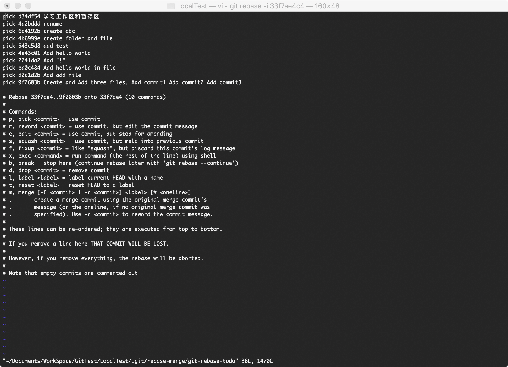
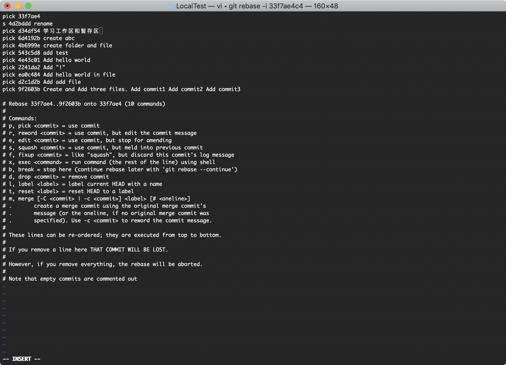
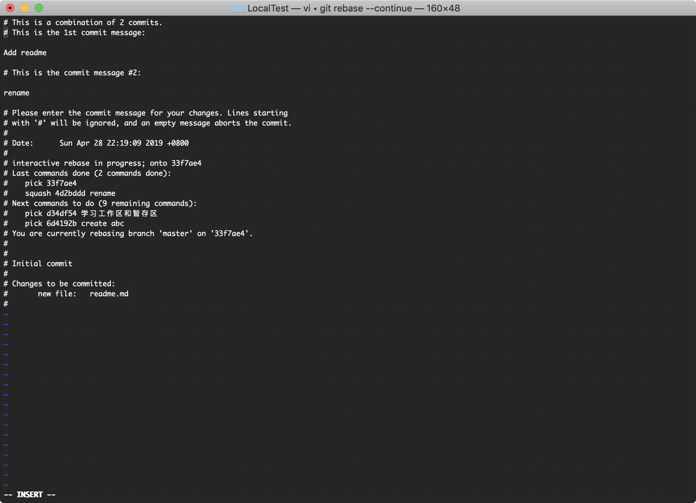
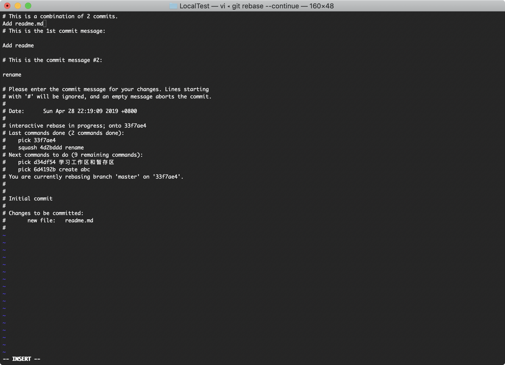

### 把间隔的几个commit整理成1个

- git rebase -i [address]

再次用到这个命令

```bash
$ git log --graph #查看日志 把两个关于readme的commit合并
* commit 9f2603b5aac31b0607312a51224a9691ed0670b4 (HEAD -> master)
| Author: xxx <xxx@xxx.com>
| Date:   Sun May 26 13:37:51 2019 +0800
| 
|     Create and Add three files.
|     Add commit1
|     Add commit2
|     Add commit3
|   
*   commit f7b88f55dc358c375cbbc26db54e7e87b551c518
|\  Merge: 9e63410 d2c1d2b
| | Author: xxx <xxx@xxx.com>
| | Date:   Sun May 26 13:34:46 2019 +0800
| | 
| |     Merge all branch
| | 
| * commit d2c1d2b68622e6ee11c2070eb36406ccb0e63655
| | Author: xxx <xxx@xxx.com>
| | Date:   Sun May 19 17:03:02 2019 +0800
| | 
| |     Add add file
| | 
| * commit ea0c4843f5ee874f4d96646d7f3a8a3adb1432f0
| | Author: xxx <xxx@xxx.com>
| | Date:   Sun May 19 16:33:15 2019 +0800
| | 
| |     Add hello world in file
| |   
* |   commit 9e63410fee4af12a8e9855d2cb6ac81a977b821e
|\ \  Merge: 1da4f5a 2241da2
| | | Author: xxx <xxx@xxx.com>
| | | Date:   Sun May 26 13:33:20 2019 +0800
| | | 
| | |     Merge branch 'fix_add1'
| | | 
| * | commit 2241da25049ad63dea9f20b094b858f0b533ed61
| | | Author: xxx <xxx@xxx.com>
| | | Date:   Sun May 19 17:01:01 2019 +0800
| | | 
| | |     Add "!"
| | | 
| * | commit 4e43c01c8f3c76aedd986d598a00b90809a3a588
| |/  Author: xxx <xxx@xxx.com>
| |   Date:   Sun May 19 16:33:15 2019 +0800
| |   
| |       Add hello world
| |   
* |   commit 1da4f5a22942c99a466508cdea306619dd5c48b0
|\ \  Merge: 4b6999e 543c5d8
| | | Author: xxx <xxx@xxx.com>
| | | Date:   Sat May 25 18:27:23 2019 +0800
| | | 
| | |     Merge branch temp
| | | 
| * | commit 543c5d84e8b5f2996e1a40745262f39df95eebaf
| | | Author: xxx <xxx@xxx.com>
| | | Date:   Mon Apr 29 22:12:57 2019 +0800
| | | 
| | |     add test
| | | 
* | | commit 4b6999eecb60df46af36c5409e3737e44b877dd7
| |/  Author: xxx <xxx@xxx.com>
|/|   Date:   Sun May 19 13:50:07 2019 +0800
| |   
| |       create folder and file
| | 
* | commit 6d4192be4c570363865468870d14f59efaa5521e
| | Author: xxx <xxx@xxx.com>
| | Date:   Sun May 19 13:46:22 2019 +0800
| | 
| |     create abc
| | 
* | commit 4d2bdddf4098e40ce57fdaf04bb862f7bea04918 #这条
|/  Author: xxx <xxx@xxx.com>
|   Date:   Mon Apr 29 21:36:15 2019 +0800
|   
|       rename
| 
* commit d34df54beffb33cf6e4f4e97d0f0e24f2b676d51 (tag: test)
| Author: xxx <xxx@xxx.com>
| Date:   Mon Apr 29 21:02:02 2019 +0800
| 
|     学习工作区和暂存区
| 
* commit 33f7ae4c4d4da85453ed0077670e242b71d0a621 #还有这条
  Author: xxx <xxx@xxx.com>
  Date:   Sun Apr 28 22:19:09 2019 +0800
  
      Add readme
$ git rebase -i 33f7ae4c4 #因为“Add readme“这条commit已经是最父亲节点 所以就选这条commit地址 弹出交互界面 如下图
The previous cherry-pick is now empty, possibly due to conflict resolution.
If you wish to commit it anyway, use:

    git commit --allow-empty

Otherwise, please use 'git reset'
interactive rebase in progress; onto 33f7ae4
Last command done (1 command done):
   pick 33f7ae4 
Next commands to do (10 remaining commands):
   squash 4d2bddd rename
   pick d34df54 学习工作区和暂存区
You are currently rebasing branch 'master' on '33f7ae4'.

nothing to commit, working tree clean
Could not apply 33f7ae4... 
$ git status #查看当前状态
interactive rebase in progress; onto 33f7ae4
Last command done (1 command done):
   pick 33f7ae4 
Next commands to do (10 remaining commands):
   squash 4d2bddd rename
   pick d34df54 学习工作区和暂存区
  (use "git rebase --edit-todo" to view and edit)
You are currently rebasing branch 'master' on '33f7ae4'.
  (all conflicts fixed: run "git rebase --continue")

nothing to commit, working tree clean
$ git rebase --continue #根据提示使用"git rebase --continue"命令 弹出交互界面 如下图
[detached HEAD 83f44c9] Add readme.md
 Date: Sun Apr 28 22:19:09 2019 +0800
 1 file changed, 0 insertions(+), 0 deletions(-)
 create mode 100644 readme.md
CONFLICT (modify/delete): readme deleted in HEAD and modified in 543c5d8... add test. Version 543c5d8... add test of readme left in tree.
error: could not apply 543c5d8... add test
Resolve all conflicts manually, mark them as resolved with
"git add/rm <conflicted_files>", then run "git rebase --continue".
You can instead skip this commit: run "git rebase --skip".
To abort and get back to the state before "git rebase", run "git rebase --abort".
Could not apply 543c5d8... add test
$ git status #查看状态 因为之前修改文件名后，合并分支的时候我将冲突文件readme添加进git库 所以这里出了冲突 这里我按照提示删掉readme文件（根据自己情况处理） 
interactive rebase in progress; onto 33f7ae4
Last commands done (6 commands done):
   pick 4b6999e create folder and file
   pick 543c5d8 add test
  (see more in file .git/rebase-merge/done)
Next commands to do (5 remaining commands):
   pick 4e43c01 Add hello world
   pick 2241da2 Add "!"
  (use "git rebase --edit-todo" to view and edit)
You are currently rebasing branch 'master' on '33f7ae4'.
  (fix conflicts and then run "git rebase --continue")
  (use "git rebase --skip" to skip this patch)
  (use "git rebase --abort" to check out the original branch)

Unmerged paths:
  (use "git reset HEAD <file>..." to unstage)
  (use "git add/rm <file>..." as appropriate to mark resolution)

	deleted by us:   readme

no changes added to commit (use "git add" and/or "git commit -a")
$ git rm readme #删除readme
readme: needs merge
rm 'readme'
$ git status #查看状态
interactive rebase in progress; onto 33f7ae4
Last commands done (6 commands done):
   pick 4b6999e create folder and file
   pick 543c5d8 add test
  (see more in file .git/rebase-merge/done)
Next commands to do (5 remaining commands):
   pick 4e43c01 Add hello world
   pick 2241da2 Add "!"
  (use "git rebase --edit-todo" to view and edit)
You are currently rebasing branch 'master' on '33f7ae4'.
  (all conflicts fixed: run "git rebase --continue")

nothing to commit, working tree clean
$ git rebase --continue #根据提示执行命令
Auto-merging abc
CONFLICT (content): Merge conflict in abc
error: could not apply ea0c484... Add hello world in file
Resolve all conflicts manually, mark them as resolved with
"git add/rm <conflicted_files>", then run "git rebase --continue".
You can instead skip this commit: run "git rebase --skip".
To abort and get back to the state before "git rebase", run "git rebase --abort".
Could not apply ea0c484... Add hello world in file
$ git rebase --continue #我又执行了一次
abc: needs merge
You must edit all merge conflicts and then
mark them as resolved using git add
$ git status #发现是还有冲突没有解决
interactive rebase in progress; onto 33f7ae4
Last commands done (9 commands done):
   pick 2241da2 Add "!"
   pick ea0c484 Add hello world in file
  (see more in file .git/rebase-merge/done)
Next commands to do (2 remaining commands):
   pick d2c1d2b Add add file
   pick 9f2603b Create and Add three files. Add commit1 Add commit2 Add commit3
  (use "git rebase --edit-todo" to view and edit)
You are currently rebasing branch 'master' on '33f7ae4'.
  (fix conflicts and then run "git rebase --continue")
  (use "git rebase --skip" to skip this patch)
  (use "git rebase --abort" to check out the original branch)

Unmerged paths:
  (use "git reset HEAD <file>..." to unstage)
  (use "git add <file>..." to mark resolution)

	both modified:   abc

no changes added to commit (use "git add" and/or "git commit -a")
$ git add abc #添加暂存区
$ git commit -m'Modified abc file' #提交
[detached HEAD 9e902c5] Modified abc file
 1 file changed, 4 insertions(+)
$ git status #查看状态
interactive rebase in progress; onto 33f7ae4
Last commands done (9 commands done):
   pick 2241da2 Add "!"
   pick ea0c484 Add hello world in file
  (see more in file .git/rebase-merge/done)
Next commands to do (2 remaining commands):
   pick d2c1d2b Add add file
   pick 9f2603b Create and Add three files. Add commit1 Add commit2 Add commit3
  (use "git rebase --edit-todo" to view and edit)
You are currently editing a commit while rebasing branch 'master' on '33f7ae4'.
  (use "git commit --amend" to amend the current commit)
  (use "git rebase --continue" once you are satisfied with your changes)

nothing to commit, working tree clean
$ git rebase --continue #再次执行continue rebase成功
Successfully rebased and updated refs/heads/master.
$ git log --graph #查看log 之前“readme”这条log已经没有了 被合并进了根节点
* commit 437387c09feefda0188db6789e4873f7c35a2621 (HEAD -> master)
| Author: xxx <xxx@xxx.com>
| Date:   Sun May 26 13:37:51 2019 +0800
| 
|     Create and Add three files.
|     Add commit1
|     Add commit2
|     Add commit3
| 
* commit 09460ecc7187a8e126891a041457e51e6693636c
| Author: xxx <xxx@xxx.com>
| Date:   Sun May 19 17:03:02 2019 +0800
| 
|     Add add file
| 
* commit 9e902c5dd82e1ce7c4831d8b3ff46d32b409542c
| Author: xxx <xxx@xxx.com>
| Date:   Mon May 27 21:47:37 2019 +0800
| 
|     Modified abc file
| 
* commit 21f4c7efb6177246d01cae84ccb2368728577aa4
| Author: xxx <xxx@xxx.com>
| Date:   Sun May 19 17:01:01 2019 +0800
| 
|     Add "!"
| 
* commit 6d43e3783cc37f9490781622f56c36ae2901ab43
| Author: xxx <xxx@xxx.com>
| Date:   Sun May 19 16:33:15 2019 +0800
| 
|     Add hello world
| 
* commit d463612e828044748283c6cc3a2c3a5bfb9a3386
| Author: xxx <xxx@xxx.com>
| Date:   Sun May 19 13:50:07 2019 +0800
| 
|     create folder and file
| 
* commit d88fcba14a272fd0f20f9e65315d6ed9c0db225a
| Author: xxx <xxx@xxx.com>
| Date:   Sun May 19 13:46:22 2019 +0800
| 
|     create abc
| 
* commit 3a1b19fa89e0e229f40b3bcc0bbf1f079d19b83f
| Author: xxx <xxx@xxx.com>
| Date:   Mon Apr 29 21:02:02 2019 +0800
| 
|     学习工作区和暂存区
| 
* commit 83f44c95d9456236929918dc7717a2bb9b452d93
  Author: xxx <xxx@xxx.com>
  Date:   Sun Apr 28 22:19:09 2019 +0800
  
      Add readme.md
      
      Add readme
      
      rename
```
####图示
- 交互界面


- 将根节点的commit地址拷贝，加入第一行pick [address]，然后将原来rename那条commit复制到第一行的下边，并使用squash命令，保存退出。


- git rebase --continue



- 添加message，保存退出。


