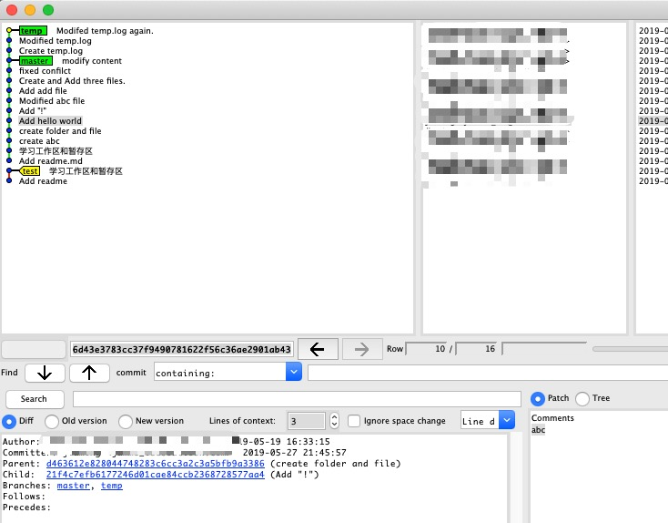
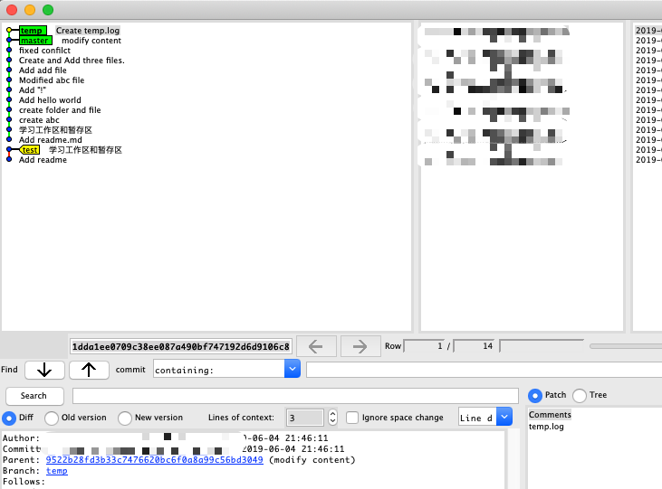

### 如何消除最近几次的提交
- git reset --hard [commit address]

<b style="color:red"> 此命令执行后，缓存区和工作区都会清空，所以一定要确定不需要这些提交信息。慎用此命令。</b>
```bash
$ gitk --all #查看gitk信息 如下图 
$ git branch -av #查看当前分支是不是再temp
  master 9522b28 modify content
* temp   59925d6 Modifed temp.log again.
$ git log --graph #查看log 将"Create temp.log（1dda1ee0709c）"之前的提交都清除掉
* commit 59925d6552044420a7ce96a2a7f403691bb4e8e2 (HEAD -> temp)
| Author: jiaming <jamme_lee@outlook.com>
| Date:   Tue Jun 4 21:49:31 2019 +0800
| 
|     Modifed temp.log again.
| 
* commit 469fb6377dfa729ed09640bc6287e5e891615315
| Author: jiaming <jamme_lee@outlook.com>
| Date:   Tue Jun 4 21:47:01 2019 +0800
| 
|     Modified temp.log
| 
* commit 1dda1ee0709c38ee087a490bf747192d6d9106c8
| Author: jiaming <jamme_lee@outlook.com>
| Date:   Tue Jun 4 21:46:11 2019 +0800
| 
|     Create temp.log
| 
* commit 9522b28fd3b33c7476620bc6f0a8a99c56bd3049 (master)
| Author: jiaming <jamme_lee@outlook.com>
| Date:   Tue May 28 21:15:31 2019 +0800
| 
|     modify content
| 
* commit 4628013a080a138d9542a9163b0590e64fd049a8
| Author: jiaming <jamme_lee@outlook.com>
| Date:   Tue May 28 21:04:42 2019 +0800
| 
|     fixed confilct
| 
* commit 437387c09feefda0188db6789e4873f7c35a2621
| Author: jiaming <jamme_lee@outlook.com>
| Date:   Sun May 26 13:37:51 2019 +0800
| 
|     Create and Add three files.
|     Add commit1
|     Add commit2
|     Add commit3
| 
* commit 09460ecc7187a8e126891a041457e51e6693636c
| Author: jiaming <jamme_lee@outlook.com>
| Date:   Sun May 19 17:03:02 2019 +0800
| 
|     Add add file
$ git reset --hard 1dda1ee0709c #执行reset命令
HEAD is now at 1dda1ee Create temp.log
$ gitk --all #再次查看gitk 1dda1ee0709c之前的提交全部清除 如下图
```

#####图示
- 清除`Create temp.log`之前的所有提交


- 已经清除提交，并且HEAD指针已经指向期望位置



